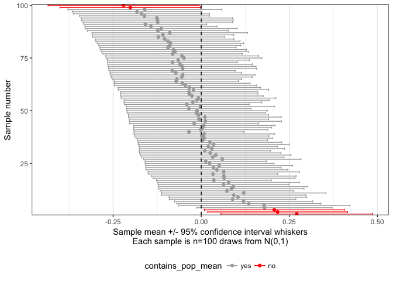

Confidence Intervals Visualised
================

This is a very brief demonstration on how to visualise confidence intervals

#### Getting started

First we clear the workspace, load required packages and set a seed for reproducibility when working with random number generation

``` r
rm(list=ls())
library('tidyverse')
set.seed(196628)
```

#### Define functions

Then we create a function for repeatedly drawing random normal distributed numbers and calculating sample mean and confidence intervals

``` r
mk_samples = function(n, size, mean = 0, sd = 1){
  m = sapply(1:n, function(i){
    s = rnorm(n = size, mean = mean, sd = sd)
    return( c(mean(s), t.test(s)$conf.int) )
  })
  rownames(m) = c("sample_mean", "ci_lower", "ci_upper")
  m = m %>% t %>% as_tibble
  return(m)
}
```

#### Make data

Now we run the `mk_samples()` function

``` r
n = 100
m = mk_samples(n = n, size = 100) %>%
  arrange(desc(ci_lower)) %>% 
  mutate(i = seq(1,n)) %>% 
  mutate(contains_pop_mean = ifelse(0 > ci_lower & 0 < ci_upper,'yes','no') %>%
           factor(levels = c('yes', 'no')))
m
```

    ## # A tibble: 100 x 5
    ##    sample_mean     ci_lower  ci_upper     i contains_pop_mean
    ##          <dbl>        <dbl>     <dbl> <int>            <fctr>
    ##  1  0.27107828  0.056091337 0.4860652     1                no
    ##  2  0.21680406  0.018569854 0.4150383     2                no
    ##  3  0.20741777  0.008901981 0.4059336     3                no
    ##  4  0.17929221 -0.012861105 0.3714455     4               yes
    ##  5  0.17851806 -0.064949428 0.4219856     5               yes
    ##  6  0.13496431 -0.069553520 0.3394821     6               yes
    ##  7  0.12009085 -0.075892146 0.3160738     7               yes
    ##  8  0.08889772 -0.090681676 0.2684771     8               yes
    ##  9  0.10405637 -0.091063876 0.2991766     9               yes
    ## 10  0.09227670 -0.112272478 0.2968259    10               yes
    ## # ... with 90 more rows

#### Visualise Confidence Intervals

Finally, we can visualise the calculated confidence intervals and see the definition of a confidence interval: If samples are repeatedly drawn from a population, then the 95% confidence interval of 95 in 100 samples contain the population mean:

``` r
m %>%
  ggplot(aes(x=sample_mean,y=i,colour=contains_pop_mean)) +
  geom_point() +
  geom_errorbarh(aes(xmin=ci_lower,xmax=ci_upper),height=1) +
  geom_vline(xintercept = 0, linetype = 'dashed') +
  scale_y_continuous(expand = c(0, 0)) +
  scale_color_manual(values=c('darkgrey','red')) +
  xlab(paste0('Sample mean +/- 95% confidence interval whiskers\n',
              'Each sample is n=100 draws from N(0,1)')) +
  ylab("Sample number") +
  theme_bw() +
  theme(panel.grid.major.y = element_blank(),
        panel.grid.minor.y = element_blank(),
        legend.position='bottom')
```


